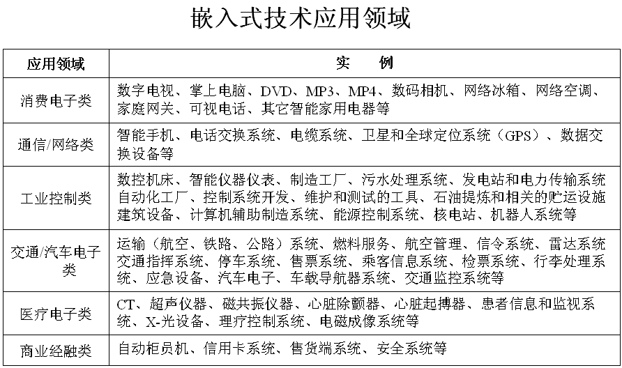
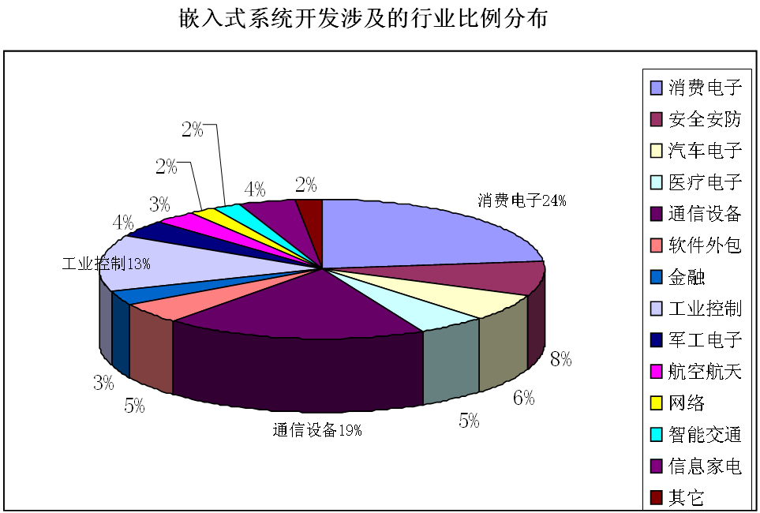
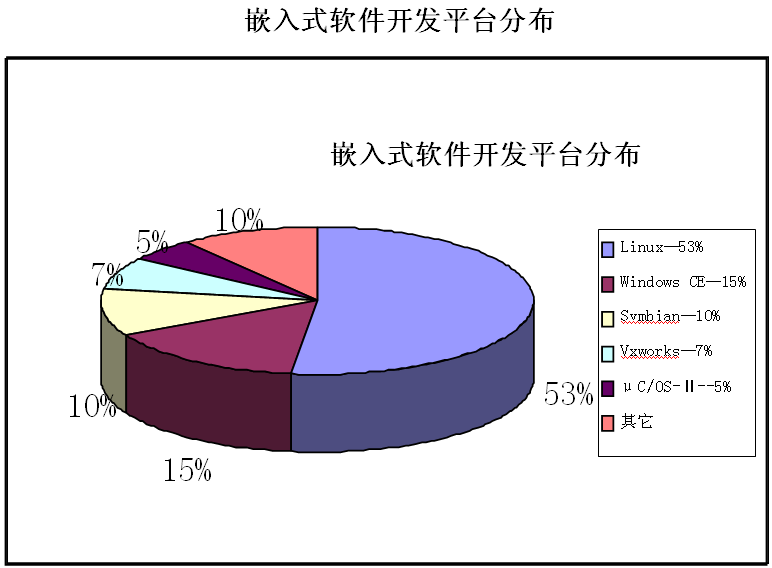

权威部门统计，我国嵌入式人才缺口每年50万人左右，供求比例达1：20，根据前程无忧网最新发布的调查报告，嵌入式软件开发是未来几年或更长的时间内最热门和最受欢迎的职业之一，初级的嵌入式软件开发人员，平均月薪也在3500—5000元左右，中高级的嵌入式工程师月薪平均超过10000元。
###1. 嵌入式技术应用领域

各行业的人才需求比例分布如下图

###2. 各行业的人才需求比例分布如下图嵌入式操作系统分布情况
Linux操作系统凭借其自由、免费、开发源代码的优势，经过来自互联网遍布全球的程序员的努力，再加上IBM、Sun等计算机巨头的支持，因而在手机操作系统市场中异军突起，其发展不容忽视。

