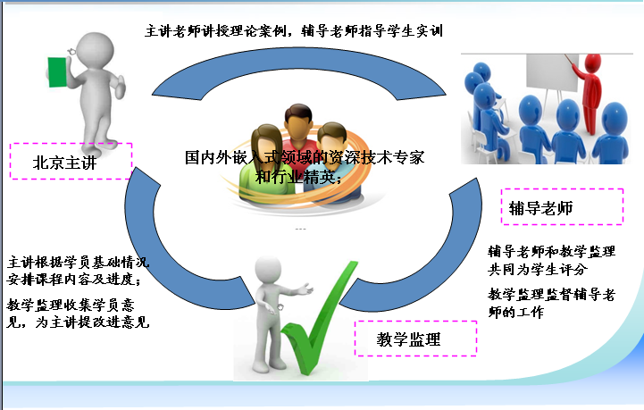

###导学”+“助学”+“促学”+“互学”的教学模式

“导学”：网络教学中，北京总部老师的技术精讲，案例教学，讲授理论课程； 
“助学”：当地助教老师的面授，解决学习者在学习中遇到的困难和疑问，辅导老师面授进行案例分析，指导当日编码练习、课堂作业、项目实战，阶段评测，一对一辅导； 
“促学”：教学监理对学习过程进行的监控和评价，学习动力的调控和学习过程的监控； 
“互学”：学生以团队进行学习，强调学生之间的互助学习，并通过小组评比，推进学习效果。  
