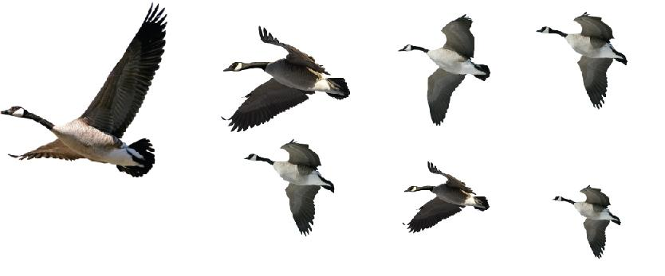

###第一章  V 型雁阵——团队精神的真谛 

 &nbsp;&nbsp;&nbsp;&nbsp;&nbsp;&nbsp;&nbsp;&nbsp;当收获的季节来临之际，天空中就会出现成群结队、翱翔高空的大雁。这些大雁为天空描绘出一幅图画，为秋天添加了色彩，同时也给我们带来了深深的启迪。雁群是一支完美的团队，它们有着共同的目标，而且为了这个共同的目标都在努力奋进，不甘落后!  在我们的企业中，也有着这样的一群人，为了同一个目标而来到公司，每个人的心中都有着一个共同的梦想。其实，我们就像是一群大雁，也有着自己的南方一一实现企业的目标和我们个人的目标。我们都应该明白这样一个道理：“有大家才有小家，有企业的未来才有 个人的明天。”所以，我们必须要像大雁一样紧密团结，才能缔造最终的成功！

###第二章     不要单飞——你需要一个团队 

 &nbsp;&nbsp;&nbsp;&nbsp;&nbsp;&nbsp;&nbsp;&nbsp;没有一只大雁会离开团队独自远行，因为每只大雁都知道，没有整个团队的努力，依靠个人的力量是无法飞抵南方的。当一只大雁偏离雁群的时候，它就会感受到巨大的阻力，最终会迷失方向，甚至成为猎人的猎物。 
同样，当一个人离开团队的时候，他也会失去发挥自身价值的舞台。因为，单枪匹马的英雄已不复存在，一个人想要达到目的就必须选择与自己志同道合的伙伴并互相扶助才能取得最好的效果，并最终赢得成功。 
工作中，我们不能特立独行、孤军奋战，更不能因为一点点成绩和为团队做出的一些贡献而满足和骄傲。我们应该明白，我们所取得的成功和辉煌都是在别人的帮助和大家的共同努力下实现的。如果没有集体的支持，没有坚强可靠的团队支撑，单凭我们个人的努力是无法实现理想目标的。 

###第三章 向上之风——我为团队，团队为我 

 &nbsp;&nbsp;&nbsp;&nbsp;&nbsp;&nbsp;&nbsp;&nbsp;当每只大雁展翅高飞时，它都会为后面的队友提供“向上之风”。 由于“V”字队形可以扩大雁群 70％的飞行范围．这股力量将使每只在团队中的大雁比它在单独飞行时提高：22 ％的飞行速度。大雁是很聪明的动物，它们选择拥有相耐目标的伙伴同行，可以彼此帮助，从而更快速、更容易地达目的地。 大雁告诉我们：分享团队默契的人能够互相帮助，更能轻松地到达目的地，因为他们在彼此信任的基础上，在携手前进。 当某只大雁掉队时它立即会感到孤独飞行的困难和阻力。因此，它会立即飞回队伍，继续利用前面同伴提供的“向上之风”不断前进。 我们应该像大雁一样具有团队意识，在队伍中跟着带队者，与团队共同奔向目的地。我们愿意接受他人的帮助，愿意帮助别人。

###第四章 鸣叫不断——团队中不能缺少沟通 

 &nbsp;&nbsp;&nbsp;&nbsp;&nbsp;&nbsp;&nbsp;&nbsp;在大雁的飞行队伍中，人们总会发现这样一个现象，那就是后面的大雁会以叫声来沟通并鼓励前面的伙伴努力前行。经过长期地观察，人们又发现，在雁群的组织中，它们分工明确，每只大雁都为自己的工作努力着。不管飞行中遇到怎样的狂风暴雨，它们始终会心怀美好的理想，坚信会见到美丽的彩虹；不管遇到了多么凶猛的敌人，它们都会共同抵抗，从不会出现临阵脱逃的现象。每只大雁都把自己的生命置之度外，危难来临，它们最先想到的是同伴的安全。在其他雁休息的时候，雁群中的领头雁却不去休息，它不吃不喝忍着疲惫，为自己的群体站岗放哨。它们为的都是一个共同的目标。 
大雁的这种心怀集体、无私奉献的精神深深地震撼着我们的心灵。在工作中，很多事情都不用我们付出太多，只要我们拥有一种奉献的精神，做一点点小事，能给别人带来小小的方便与温暖就可以了。我们人类应该向大雁学习，学习它们可以拼尽全力为伙伴在挑战命运之时加油、呐喊、助威，且尽自己的全力去帮助伙伴的精神。 

###第五章 头雁精神——支持团队的领导 

 &nbsp;&nbsp;&nbsp;&nbsp;&nbsp;&nbsp;&nbsp;&nbsp;群雁高飞头雁领，不论飞行还是栖息，都能看到头雁的引领。
头雁，不仅需要首先突破空气的阻力，往往也会第一个迎接前进中的困难。所以，头雁必须有强大的精神和强壮的体魄。头雁在率领雁群朝着理想的目标行进的过程中，会遇到来自外部和内部的多重矛盾，甚至是危险。这需要头雁随时敏锐地洞察现状，及时地判断分析，准确地做出科学的决策并且监督好执行的情况。 
雁群飞行过程中，头雁最辛苦，没有任何力量可以借助。一旦头雁疲倦，就会主动地退回到队伍中而由另外一只大雁取代。 
所有的大雁都服从领头雁的领导，并无条件地接受团队的飞行队形。不管遭遇何种情况，同伴都会相互帮忙，飞往大家共同前进的目标一一南方。 

###第六章 振翅高飞——和团队一起成功 

 &nbsp;&nbsp;&nbsp;&nbsp;&nbsp;&nbsp;&nbsp;&nbsp;大雁在飞行的过程中，既便遇到种种困难都不会把它们打倒，它们总能目标一致，齐心协力，最后成功地到达目的地。 
群雁具有一种强势超达的生存力，企业经营也应当如此。企业组织要想形成一个有机体，必须拥有群雁那种清晰的战略目标，更要打造不同的团队去实现目标，做到分工明确。我们要学习大雁团结一致的精神，为实现一个共同的目标而振翅高飞。太阳的光辉迎着大雁，太阳的光辉更照耀着我们。我们要做阳光下最强大的群雁! 
为了实现梦想，让我们激情工作；为了我们的远大目标。让我们做只只翱翔在蓝天的大雁，让我们的企业精神更具特色，让我们的企业展翅翱翔!
